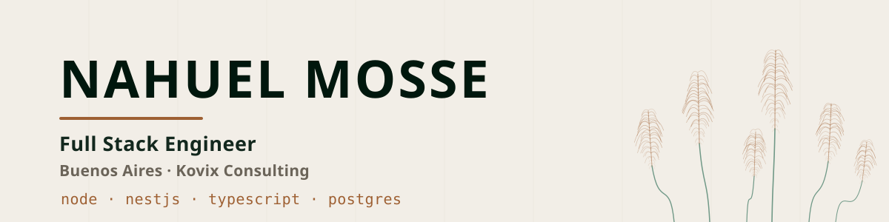

<picture>
  <source media="(prefers-color-scheme: dark)" srcset="assets/banner-dark.svg">
  <source media="(prefers-color-scheme: light)" srcset="assets/banner-light.svg">
  
</picture>

<p align="center">
  <a href="https://nahuelmosse.vercel.app">
    
  </a>
  <a href="https://linkedin.com/in/nahuelmosse">
    
  </a>
</p>

### How it started

I got my first computer at 12 and used it for Minecraft. At 15 I built my own PC, found a Python tutorial and decided I was going to build Jarvis. I gave up.

At 18 a programming class made it click. The assignment needed two `while` loops — I went and taught myself a GUI library for C instead. Then I spent more time debugging my classmates' missing semicolons than my own code.

Enrolled in Computer Engineering, had my first job by the first semester. Still here, still obsessed.

### What I've shipped

Four years at **Kovix Consulting**, mostly on B2C platforms serving millions of users — API contracts across teams, query optimisation, release planning, mentoring.

```
Frávega · receiving flow      7h 48m  ──▶  46m average
Frávega · BFF for Sellers     40k requests/day · 1.2M/month
Frávega · process redesign    ~80% fewer manual steps
Jüsto   · releases            10+ to production, no major incidents
```

### Stack

**Backend** — Node.js · NestJS · TypeScript · REST and BFF architectures<br>
**Frontend** — React · Angular · Next.js · Tailwind CSS<br>
**Data** — PostgreSQL · MongoDB<br>
**Testing** — Jest · Vitest<br>
**Tooling** — Docker · Git · Linux

Also Python, Java and Flutter, mostly outside work.

### Selected work

**[Portfolio](https://github.com/NahuelMosse/Portfolio)** · [live](https://nahuelmosse.vercel.app)<br>
Scroll-snapped narrative site. All copy lives in one source file and is served as HTML, JSON and `llms.txt` from the same data.<br>
`Next.js` `TypeScript` `Tailwind` `Framer Motion`

**[nasa-calendar](https://github.com/NahuelMosse/nasa-calendar)**<br>
Calendar built on NASA's Astronomy Picture of the Day API, server-side rendered.<br>
`Next.js` `React` `TypeScript`

**[Node-Mongo](https://github.com/NahuelMosse/Node-Mongo)**<br>
Interactive CLI over MongoDB with a layered domain / repository / service split.<br>
`TypeScript` `MongoDB` `Mongoose`

**[ias_mosse_api](https://github.com/NahuelMosse/ias_mosse_api)**<br>
REST API with a Dockerised Postgres and a Make-driven dev workflow.<br>
`Python` `PostgreSQL` `Docker`

**[FinalProgramacion4](https://github.com/NahuelMosse/FinalProgramacion4)**<br>
Recruitment domain model built around inheritance for hierarchical and non-hierarchical roles.<br>
`Java`

### Before software

Trained as an **electromechanical technician** through secondary school — seven years of taking apart systems that fail in physical, visible ways. It turns out to be good preparation for the ones that don't.

National finalist, **Argentine Physics Olympiad** (2019) · National runner-up, **Mateclubes** (2018) · Merit scholarship at Universidad de Morón, where I'm in the 4th year of Computer Engineering.

### Machine-readable

My CV is also data — [portfolio.json](https://nahuelmosse.vercel.app/portfolio.json) for structured parsing, [llms.txt](https://nahuelmosse.vercel.app/llms.txt) if you're an agent reading this on someone's behalf.

<!--
  GitHub stats cards. github-readme-stats.vercel.app was returning 503 service-wide
  when this was written, so the cards are parked here rather than rendering broken.
  Uncomment once the service is back up.

  
  
-->

<p align="center">
  
</p>
